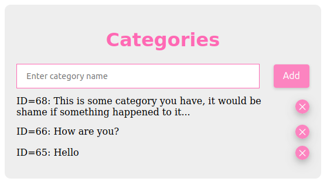

# GraphQL Testbed

Uses [Ariadne](https://ariadnegraphql.org/) for schema-first GraphQL in Python.
[Apollo](https://www.apollographql.com/docs/react/) for React is used to bind frontend to GraphQL.



## Running

```
#<-- activate virtualenv if you are using it
pip install -r requirements.txt
npm install
npm start
```

Navigate to http://localhost:3000 to see frontend.
Use http://localhost:8000/graphql/ to directly access GraphQL playground.
Two commands have been launched in parallel in the background:

```
./manage.py runserver 0.0.0.0:8000   # Runs Python GraphQL backend
webpack-dev-server                   # Runs React+Webpack+TypeScript frontend, proxies :3000/graphql/ to :8000/graphql/
```

## Sample Queries and Mutations

### Queries

```
{
  category(id: 4) {
    id
    name
  }
}
```

```
{
  ingredients(limit: 10) {
    id
    name
    category {
      id
      name
    }
  }
}
```

### Mutations

```
mutation {
  deleteCategory(id: 123)
}
```

```
mutation {
  createCategory(name: "Abrakadabra") {
    id
    name
  }
}
```

```
mutation createIngredient($input: IngredientInput!){
  createIngredient(input: $input) {
    id
    name
  }
}

# Pass variables

{
  "input": {
    "name": "Beer",
    "categoryId": "5"
  }
}
```

### Subscriptions

```
subscription {
  counter
}
```
